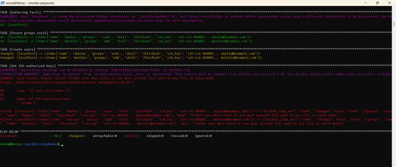

# ⚙️ Ansible Playbooks
A collection of Ansible playbooks for Linux systems automation. Covers user management, package installation, service configuration and system hardening. All playbooks are idempotent and fully documented.

Built and documented by [Nerea Arce](https://www.linkedin.com/in/nerea-arce/) · SysAdmin & DevOps Engineer

## Live output

---
## Playbooks
| Playbook | Description |
|----------|-------------|
| `user_management.yml` | Create, delete and manage Linux users and groups |
| `package_install.yml` | Install and configure common packages |
| `service_config.yml` | Configure and manage system services |
| `system_hardening.yml` | Apply security best practices to Linux systems |

---
## Repository structure
    ansible-playbooks/
    ├── inventory/
    │   └── hosts.ini         # Inventory file
    ├── playbooks/
    │   ├── user_management.yml
    │   ├── package_install.yml
    │   ├── service_config.yml
    │   └── system_hardening.yml
    ├── ansible.cfg           # Ansible configuration
    └── README.md

---
## Prerequisites
- Ansible >= 2.12
- SSH access to target hosts
- Python 3 on target hosts

---
## Usage
Clone the repository:

    git clone https://github.com/arcenerea/ansible-playbooks
    cd ansible-playbooks

Edit the inventory file with your hosts:

    nano inventory/hosts.ini

Run a playbook:

    ansible-playbook -i inventory/hosts.ini playbooks/user_management.yml

Run with verbose output:

    ansible-playbook -i inventory/hosts.ini playbooks/user_management.yml -v

Dry run (check mode):

    ansible-playbook -i inventory/hosts.ini playbooks/user_management.yml --check

---
## Playbooks in detail

### user_management.yml
Creates and manages Linux users and groups. Assigns SSH keys, sets shells and manages sudo access. Idempotent — safe to run multiple times.

### package_install.yml
Installs and configures common packages: curl, git, vim, htop, ufw and more. Updates the package cache before installing.

### service_config.yml
Configures and manages system services: enables on boot, starts, stops or restarts services as needed.

### system_hardening.yml
Applies security best practices: disables root SSH login, configures UFW firewall rules, sets password policies and removes unnecessary packages.

---
## Tech stack

---
## Author
**Nerea Arce** — SysAdmin · DevOps · Cloud Infrastructure

